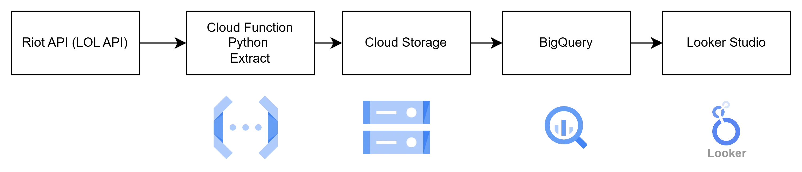

# League of Legends API Data Pipeline

## 概要
Riot Games の League of Legends API を利用して  
**対戦データを収集・保存・分析するデータパイプライン**を構築しました。

API から取得したデータを  
- Cloud Storage に **Rawデータとして保存**
- BigQuery に **分析用データとして格納**  
することで、再処理可能かつ分析しやすい構成にしています。

実際に約100件の試合データを取得し、結果を分析しました。

**分析結果：[Looker Studioダッシュボード](https://lookerstudio.google.com/reporting/b1bb0726-38df-4ea7-bdfd-07c3d78ca0e2)**

---

## このプロジェクトを作った理由
- API → DWH → BI までの **データエンジニアリング全体像を理解したかった**
- 無料枠で運用可能な **現実的なクラウド構成**を設計したかった

---

## アーキテクチャ


```
Riot API
  ↓
Python（データ取得）
  ↓
Cloud Storage（Raw JSON）
  ↓
BigQuery（構造化データ）
  ↓
Looker Studio（可視化）
```

---

## 使用技術
- Python
- Riot Games API
- Google Cloud Storage
- BigQuery

---

## 設計上のポイント
- RawデータをGCSに保存し、再処理可能な構成に
- match_id をキーに BigQuery で重複を防止

---

## セットアップ（簡略）

```bash
python -m venv venv
source venv/bin/activate
pip install -r requirements.txt
cp env.example .env
```

`.env` に以下を設定：

```env
RIOT_API_KEY=your_api_key
GCP_PROJECT_ID=your_project_id
GCS_BUCKET_NAME=your_bucket_name
GOOGLE_APPLICATION_CREDENTIALS=/path/to/service-account-key.json
```

---

## 実行方法

```bash
python src/main.py
```

保存先は環境変数で制御できます。

```bash
SAVE_TO_GCS=true python src/main.py
SAVE_TO_BIGQUERY=true python src/main.py
```

---

## プロジェクト構成

```bash
lol-api-data-pipline/
├── src/
│   ├── main.py                 # パイプラインのエントリーポイント
│   ├── master_players.py       # マスターリーグプレイヤー取得
│   ├── match_id.py             # マッチID取得
│   ├── match_history.py        # マッチ詳細取得
│   ├── upload_to_gcs.py        # Cloud Storage保存
│   ├── download_gcs_file.py    # GCSファイルダウンロード
│   ├── load_to_bigquery.py     # BigQuery保存
│   └── remove_duplicates.py    # 重複データ削除
├── assets/
│   └── architecture.png        # アーキテクチャ図
├── requirements.txt
├── env.example
├── .gitignore
└── README.md
```

---

## 現在できていること

- ローカル環境からのマスターリーグプレイヤー取得
- マッチID取得
- マッチ詳細取得
- GCS / BigQuery への保存
- Looker Studioでの可視化

---

## 今後の改善予定

- クラウド環境での処理実行(Cloud Run or Cloud Function)
- RiotAPIのレート制限の対策、データ量が増えた時の対策
- CI/CDの導入, 定期実行の自動化
- インフラ構成のIaC化
- データ品質チェックの追加

---

## ライセンス

MIT